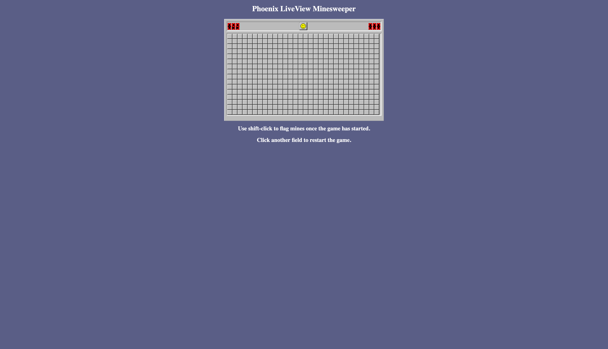
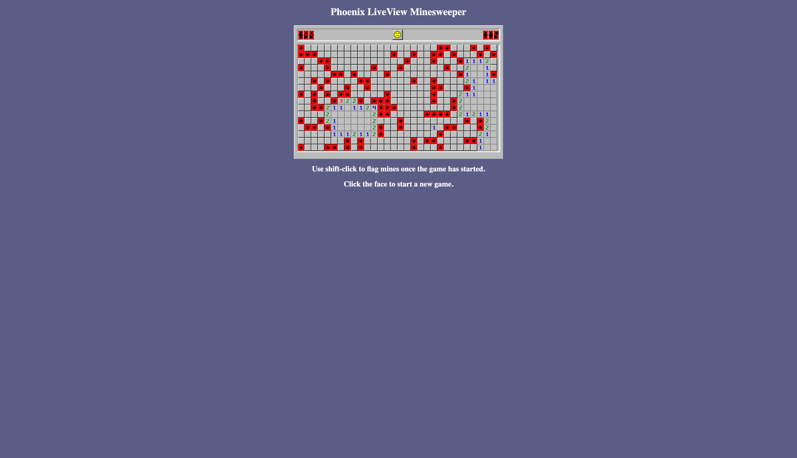

# Minesweeper

Built using Elixir Phoeinix LiveView.

To start your Phoenix server:

- Install dependencies with `mix deps.get`
- Install Node.js dependencies with `cd assets && npm install`
- Start Phoenix endpoint with `mix phx.server`

Now you can visit [`localhost:4000`](http://localhost:4000) from your browser.
